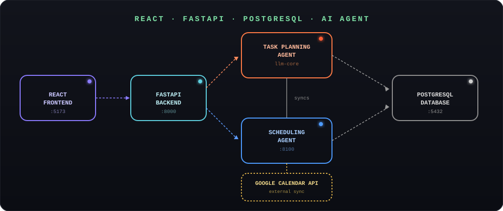

#  Autonomous Personal Productivity AI Agent

<p align="center">
  <b>AI-powered productivity assistant that autonomously plans, schedules, tracks, and optimizes user tasks.</b>
</p>

---

<p align="center">
  
</p>

---

## 🚀 Technology Stack

<p>


</p>

---

## 📌 Overview

Aura AI is an intelligent productivity management system that uses **Agentic Artificial Intelligence** to automate personal task planning, scheduling, and productivity optimization.

Unlike traditional productivity applications that rely on manual task creation and fixed reminders, Aura AI understands user goals, breaks them into actionable tasks, creates optimized schedules, monitors progress, and adapts future plans based on user behavior.

The system uses AI reasoning and planning agents to improve productivity, consistency, and task completion rates.

---
<p>
  <a href="https://drive.google.com/file/d/1yp1O9ausTYvrZq7MzORCpAmrD237YLbd/view?usp=sharing">
    
  </a>
</p>

#  Problem Statement

Traditional productivity tools require users to manually:

- Create task lists
- Plan schedules
- Set reminders
- Track progress

These systems do not learn from user behavior or automatically optimize schedules when tasks are missed.

Aura AI solves this problem by providing an autonomous AI agent that:

- Understands user goals
- Generates actionable tasks
- Creates intelligent schedules
- Learns productivity patterns
- Provides personalized insights

---

# ✨ Features

##  AI Goal Understanding

- Accepts goals in natural language
- Converts high-level goals into smaller actionable tasks
- Identifies task priority and difficulty

Example:

```
"Learn Machine Learning in 2 weeks"

↓

Tasks:
✔ Learn Python basics
✔ Study ML algorithms
✔ Practice projects
✔ Revise concepts
```

---

##  Intelligent Task Planning

- Organizes generated tasks into workflows
- Maintains task dependencies
- Creates structured execution plans

---

##  Dynamic AI Scheduling

- Assigns tasks to optimal time slots:

  - Morning
  - Afternoon
  - Evening

Considers:

- Task priority
- Deadline
- Difficulty
- User productivity patterns

---

##  Productivity Analytics

Provides insights such as:

- Task completion rate
- Missed tasks
- Productivity trends
- Best working hours
- Activity patterns

---

##  Adaptive Planning

The system continuously learns from:

- Completed tasks
- Missed tasks
- User interaction history

and improves future scheduling decisions.

---

##  Google Calendar Integration

- Automatically synchronizes tasks
- Provides real-time calendar scheduling
- Helps users manage daily activities efficiently

---

#  System Architecture

```
                User Goals
                    |
                    ↓
        Goal Understanding Agent
                    |
                    ↓
        Task Planning Agent
                    |
                    ↓
        Dynamic Scheduling Agent
                    |
        -------------------------
        |                       |
        ↓                       ↓
Behavior Analysis Agent   Analytics Agent
        |                       |
        -------------------------
                    |
                    ↓
             Productivity Insights
```

---

# 🛠️ Tech Stack

## Frontend

- React.js
- JavaScript (ES6)
- CSS3
- Recharts
- Axios

## Backend

- FastAPI
- Python
- Uvicorn

## AI Layer

- LangChain
- LangGraph
- LLM-based Task Planning Agent
- AI Scheduling Agent
- Behavioral Analytics Engine

## Database

- PostgreSQL

## External Services

- Google Calendar API

## Development Tools

- Git
- GitHub
- VS Code

---

# 📂 Project Structure

```
autonomous-productivity-agent/
│
├── aura-frontend/                 
│   └── src/
│       ├── components/           
│       ├── pages/                
│       ├── styles/               
│       ├── assets/                
│       └── App.jsx              
│
├── backend/                       
│   ├── agents/                    
│   │   ├── goal_agent/           
│   │   ├── planning_agent/       
│   │   ├── scheduling_agent/     
│   │   ├── behavior_agent/        
│   │   └── analytics_agent/       
│   │
│   ├── routes/                  
│   │   ├── auth.py              
│   │   ├── goal_routes.py         
│   │   └── task_routes.py      
│   │
│   ├── models.py                  
│   ├── database.py               
│   ├── config.py                  
│   ├── main.py                    
│   ├── storage/                  
│   └── utils/                    
│
├── requirements.txt              
│
├── productivity_ai.db           
│
├── architecture-diagram.svg       
│
├── app.bd                      
│
├── README.md                     
│
└── .gitignore                    
```

---

# 🔄 Working Methodology

### 1. Goal Input

User enters a goal using natural language.

Example:

```
Prepare for Data Science interview in 30 days
```

---

### 2. Goal Understanding Agent

The AI analyzes the goal and generates:

- Tasks
- Priority
- Difficulty level

---

### 3. Task Planning Agent

Creates a structured workflow by organizing:

- Goals
- Dependencies
- Task sequence

---

### 4. Dynamic Scheduling Agent

Assigns tasks into optimized time slots based on:

- Priority
- Deadlines
- Productivity patterns

---

### 5. Behavior Analysis Agent

Studies:

- Completed tasks
- Missed tasks
- Working patterns

---

### 6. Analytics Agent

Generates:

- Productivity trends
- Completion statistics
- AI recommendations

---

# ⚙️ Installation & Setup

## Clone Repository

```bash
git clone https://github.com/DivyaMadugula/autonomous-productivity-agent.git
```

---
# ⚙️ Backend Setup

### Create and activate virtual environment

```bash
# Create virtual environment

python -m venv venv
```

### Activate on Windows

```bash
venv\Scripts\activate
```

### Activate on macOS/Linux

```bash
source venv/bin/activate
```

---

### Install Backend Dependencies

```bash
cd backend

pip install -r requirements.txt
```

---

### Start Backend Server

```bash
uvicorn main:app --reload
```

The backend server will start successfully.

---

# 🌐 Frontend Setup

Navigate to the frontend directory:

```bash
cd aura-frontend
```

Install frontend dependencies:

```bash
npm install
```

Start the frontend application:

```bash
npm start
```

---

#  Results

Aura AI successfully provides:

✔ Automatic goal decomposition  
✔ Structured task generation  
✔ Intelligent scheduling  
✔ Productivity tracking  
✔ Adaptive planning based on behavior  

---

# 📄 License

This project is developed for educational and research purposes.
